# Agenda

1. **The Product** — what `dpqs::sort` is and what it delivers
2. **Research Gap & Methodology** — why another sort, how we measured
3. **Sequential Walkthrough** — seven guards, in execution order
    - Early termination $\cdot$ type dispatch
    - Insertion leaves $\cdot$ run-merging $\cdot$ heapsort fallback
    - Dual-pivot $\cdot$ Dutch National Flag
4. **Parallel Path** — work-stealing, scaling curve
5. **VTune Root-Cause** — why 16T regresses
6. **Engineering, Limitations, Conclusion**
7. **Q & A**

---

# Section 1 — The Product

\large

\begin{enumerate}
\item \textcolor{accent}{\textbf{The Product}} \hfill \textcolor{accent}{\textbf{◀}}
\item {\color{gray}Research Gap \& Methodology}
\item {\color{gray}Sequential Walkthrough}
\item {\color{gray}Parallel Path}
\item {\color{gray}VTune Root-Cause}
\item {\color{gray}Engineering, Limitations, Conclusion}
\item {\color{gray}Q \& A}
\end{enumerate}

---

# The Product: `dpqs::sort(...)`

::: columns

:::: column

**What it is**

- Header-only C++17 sorting library
- Drop-in replacement for `std::sort`
- Same iterator + comparator contract

**What it delivers**

- `=` parity on random 32-bit `int`
- \textcolor{good}{\textbf{$\sim$10$\times$}} on reverse-sorted (near-linear)
- \textcolor{good}{\textbf{4.72$\times$}} peak parallel speedup
- Zero dependencies — one `#include`

::::

:::: column

```cpp
#include "dual_pivot_quicksort.hpp"

std::vector<int> v = {...};

// Auto-parallel (default)
dual_pivot::sort(v);

// Iterator form
dual_pivot::sort(v.begin(), v.end());

// Force sequential
dual_pivot::sort(v, 1);

// Custom comparator
dual_pivot::sort(v, std::greater<int>{});
```

::::

:::

---

# Section 2 — Research Gap & Methodology

\large

\begin{enumerate}
\item {\color{gray}The Product}
\item \textcolor{accent}{\textbf{Research Gap \& Methodology}} \hfill \textcolor{accent}{\textbf{◀}}
\item {\color{gray}Sequential Walkthrough}
\item {\color{gray}Parallel Path}
\item {\color{gray}VTune Root-Cause}
\item {\color{gray}Engineering, Limitations, Conclusion}
\item {\color{gray}Q \& A}
\end{enumerate}

---

# Research Gap — Why Another Sort?

::: columns

:::: {.column width=52%}

**The Java–C++ discrepancy**

- Java adopted Yaroslavskiy's dual-pivot quicksort in **JDK 7 (2011)** for primitive types
- C++ `std::sort` (libstdc++, libc++, MSVC) still uses \textbf{single-pivot Introsort} [3]
- No widely adopted, STL-compliant dual-pivot implementation exists in production C++

**Does the Java win translate to C++?**

- Java: expensive comparisons → "more comparisons, fewer memory accesses" is a clear win
- C++: templates inline comparators → comparisons are near-free
- \textbf{Open question:} does the memory-traffic reduction survive?

::::

:::: {.column width=48%}

\begin{tcolorbox}[colback=accent!5,colframe=accent,boxrule=0.6pt,title=\textbf{What this project does}]
\small
\begin{enumerate}
\item \textbf{Engineer} a modern, STL-compliant C++17 dual-pivot sort
\item \textbf{Measure} whether it can beat \texttt{std::sort} in a native environment
\item \textbf{Extend} it with adaptive run-merging, DNF, and work-stealing parallelism
\end{enumerate}
\end{tcolorbox}

\vfill
\footnotesize\emph{Existing C++ DPQS code is non-generic, experimental, or pre-C++11 — not production-grade.}

::::

:::

---

# Methodology

::: columns

:::: {.column width=52%}

**Hardware**

- Intel Core i5-12600KF
- 6 P-cores (SMT) + 4 E-cores — **10 physical / 16 logical**
- L1-D: 6 $\times$ 48 KB (P) + 4 $\times$ 32 KB (E)
- L1-I: 6 $\times$ 32 KB (P) + 4 $\times$ 64 KB (E)
- L2: 6 $\times$ 1.25 MB (P) + 2 $\times$ 2 MB (E-cluster)
- **L3: 20 MB** shared
- 32 GB DDR5 @ 2992.7 MHz

**Compiler**

- GCC 13.3.0 (MinGW-w64)
- `-std=c++17 -O2 -march=native -DNDEBUG`
- `-pthread`

::::

:::: {.column width=48%}

**Workload — 7 872 configurations**

- **6 algorithms** — `std::sort`, `dual_pivot_sequential`, `dual_pivot_parallel_{2,4,8,16}`
- **4 data types** — `int`, `int8_t`, `int16_t`, `double`
- **8 patterns** — random, nearly-sorted, reverse-sorted, organ-pipe, sawtooth, many-duplicates {10, 50, 90}%
- **41 sizes** — log-spaced $10^3 \rightarrow 10^7$

**Randomness**

- 10 seeds (42…51)
- **3 warmups + 10 timed** per seed
- Representative = **median of per-seed minima** (100 samples)

**Structured patterns**

- 30 iterations, min-time

::::

:::

---

# Section 3 — Sequential Walkthrough

\large

\begin{enumerate}
\item {\color{gray}The Product}
\item {\color{gray}Research Gap \& Methodology}
\item \textcolor{accent}{\textbf{Sequential Walkthrough}} \hfill \textcolor{accent}{\textbf{◀}}
\item {\color{gray}Parallel Path}
\item {\color{gray}VTune Root-Cause}
\item {\color{gray}Engineering, Limitations, Conclusion}
\item {\color{gray}Q \& A}
\end{enumerate}

---

# Execution Flow — What Happens Inside `dpqs::sort(...)` [1]

\footnotesize

```text
 sort(container | iter,iter | ptr,len)
         |
         v
 [Step 0]  Normalize API overloads
           -> sort(T* a, parallelism, lo, hi, Compare)
         |
         v
 [Step 1]  Guards: null / range / early-termination scan  --> DONE (sorted)
         |
         v
 [Step 2]  Type dispatch (if constexpr)
         |--- int8/int16 ---------> counting_sort()        --> DONE
         |--- float/double -------> sort_floats()
         |--- parallel eligible --> parallelQuickSort()    --> §3
         |--- otherwise ----------> sort_sequential()
```

\small\color{accent}\emph{Steps 3--5 continue on the next slide.}

---

# Execution Flow (cont.) — Steps 3, 4, 5

\footnotesize

```text
 [Step 3]  Compute max_depth = 2 * log2(n) * DELTA
           (introsort safety net)
         |
         v
 [Step 4]  Recursive core — guards 4.1 ... 4.7
           (walked in detail on next slides)
         |
         v
 [Step 5]  Return (sorted in place)
```

\vspace{0.6em}

\begin{tcolorbox}[colback=accent!5,colframe=accent,boxrule=0.5pt]
\small We walk the numbered steps in execution order, and show the benchmark number each step earns.
\end{tcolorbox}

---

# Step 1 — Early Termination (Free O(n) Win)

::: columns

:::: {.column width=55%}

**Guard:** single linear scan before any sorting work

- `low >= high` → return
- Null check / range validation
- **`checkEarlyTermination`:** O(n) scan; if already sorted → done

**Result** — fully-sorted input, 10⁷ int

\bigskip
\begin{tabular}{ll}
\toprule
\texttt{std::sort} & $\approx$ baseline (still partitions) \\
\texttt{dpqs}      & \textcolor{good}{\textbf{near-instant (O(n))}} \\
\bottomrule
\end{tabular}

::::

:::: {.column width=45%}

\begin{tcolorbox}[colback=good!5,colframe=good]
\textbf{Takeaway}

The cheapest guard wins the easiest case outright.
\end{tcolorbox}

\vfill
\footnotesize
\emph{"Data is already sorted" is more common in production than people think — log ingestion, prefix arrays, time-series append.}

::::

:::

---

# Step 2 — Type Dispatch (Compile-Time `if constexpr`)

| Type | Strategy | Complexity |
|------|----------|-----------|
| `int8_t`, `int16_t` | **Counting sort** [6] | O(n + k) |
| `float`, `double` | `sort_floats` (NaN / ±0 aware) | O(n log n) |
| Parallel-eligible | `parallelQuickSort` (§3) | O(n log n / p) |
| Otherwise | Dual-pivot quicksort [2] | O(n log n) |

\vfill

::: columns
:::: {.column width=50%}
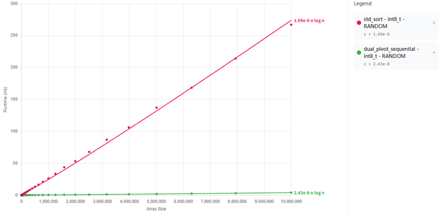{width=100%}
::::
:::: {.column width=50%}
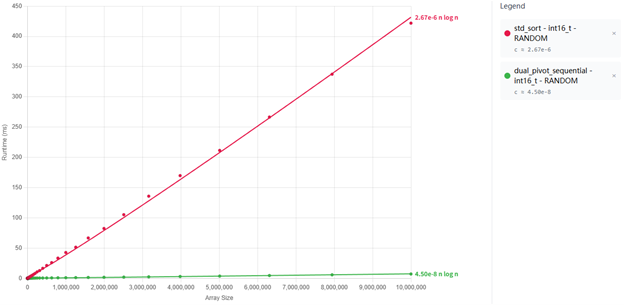{width=100%}
::::
:::

\begin{center}\small\textbf{\color{good}$\sim$8--10$\times$ on \texttt{int8\_t} \quad$\cdot$\quad $\sim$5--7$\times$ on \texttt{int16\_t}}\end{center}

---

# Step 4 — Recursive Core: Seven Guards, in Order

\scriptsize

```text
sort_sequential(lo, hi, leftmost):
    size = hi - lo
    if size < 65  and !leftmost         -> 4.1  mixed (pin) insertion sort
    if size < 45  and leftmost          -> 4.2  plain insertion sort
    if size > MIN_TRY_MERGE_SIZE:
        if try_merge_runs(...)          -> 4.3  Timsort-style run merge  <DONE>
    if depth >= max_depth               -> 4.4  heapsort fallback [3]    <DONE>

    # --- pivot machinery ---
    sort5_network(a[e1..e5])            -> 4.5  9-comparator network
    if a[e1] < a[e2] < a[e3] < a[e4] < a[e5]:
        dual_pivot_partition(P1=e1, P2=e5)   -> 4.6a  3 regions
    else:
        dnf_partition(P=e3)                  -> 4.6b  [<P][=P][>P]
    # --- recurse (4.7): loop on largest, recurse on two smaller ---
```

\normalsize
\begin{center}\color{accent}\emph{Each guard is shown next with the input pattern where it dominates.}\end{center}

---

# 4.1 / 4.2 — Insertion-Sort Leaves (Classical)

::: columns
:::: {.column width=50%}

**What & why**

- `size < 65` (non-leftmost) → **mixed/pin insertion**; left pivot is a sentinel so no bound check
- `size < 45` (leftmost) → **plain insertion**
- Every leaf of the quicksort tree hits one of these

**Result — random int, 10⁷**

| Algorithm | Speedup |
|-----------|---------|
| `std::sort` | baseline |
| `dpqs` | **$\approx$ 1.1$\times$** |

::::
:::: {.column width=50%}

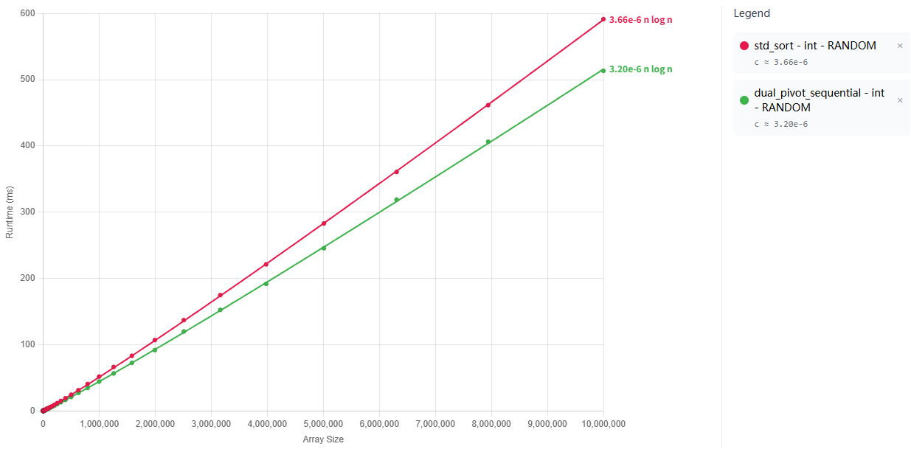{width=100%}

::::
:::

---

# 4.3 — Adaptive Run-Merging (Timsort Lineage [4])

::: columns
:::: {.column width=54%}

**Scan for ascending / descending / constant runs**

- If first run `< MIN_FIRST_RUN_SIZE` → **bail out fast** (random data pays tiny cost)
- Else merge runs in $O(n \log r)$ — **no partitioning, no recursion spawned**

\footnotesize\emph{$r$ = number of monotone runs detected in the input ($1 \le r \le n/2$). Nearly-sorted $\Rightarrow r$ small $\Rightarrow$ near-linear.}\normalsize

| Pattern | Speedup |
|---------|---------|
| Nearly-sorted | $\approx 0.74\times$ (slower) |
| Reverse-sorted | \textcolor{good}{\textbf{$\approx 10\times$}} (near-linear) |
| Organ-pipe / Sawtooth | see figures |

::::
:::: {.column width=46%}

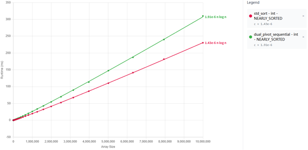{width=88%}

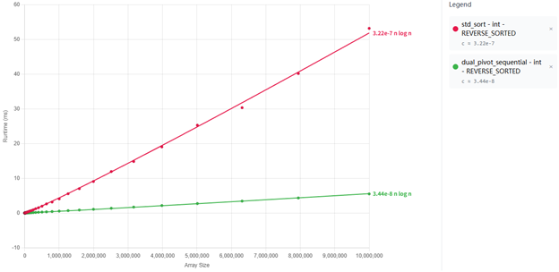{width=88%}

::::
:::

---

# 4.3 (cont.) — Organ-Pipe & Sawtooth

::: columns
:::: column
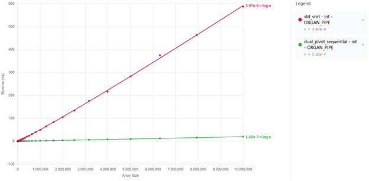{width=100%}
::::
:::: column
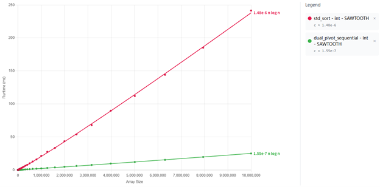{width=100%}
::::
:::

\begin{center}\small
One forward scan detects the runs; one merge pass fuses them. \\
Full sort collapses to linearithmic work in $r$ = \#runs, often $r \ll \log n$.
\end{center}

---

# 4.5 / 4.6 — Pivots From a 9-Comparator Network

::: columns
:::: {.column width=48%}

**Pick 5 samples** anchored to the two ends:

\footnotesize
```text
step = (size / 8) * 3 + 3   // ~ 3/8 size
e1   = low  + step          // ~ 3/8 point
e5   = high - step          // ~ 5/8 point
e3   = (e1 + e5) / 2        // middle
e2   = (e1 + e3) / 2
e4   = (e3 + e5) / 2
```
\normalsize

Samples sit inside the central quarter, giving more balanced pivots.

**Sort with hardcoded network** — `sort5_network` = 9 comparators, branch-free.

\vspace{0.3em}
**Then branch on ordering:**
\vspace{0.3em}

```text
if a[e1] < a[e2] < a[e3]
         < a[e4] < a[e5]:
    # strictly ordered
    DUAL-PIVOT  (4.6a)
else:
    # duplicates suspected
    DNF         (4.6b)
```

::::
:::: {.column width=52%}

\small

**4.6a — Dual-pivot partition** [2]

```text
[ < P1 ][ P1 <= x <= P2 ][ > P2 ]
 P1 = a[e1],  P2 = a[e5]
 backward scan + prefetch
```

\vspace{0.3em}

**4.6b — Dutch National Flag** [5]

```text
[ < P ][ = P ][ > P ]
 P = a[e3]
 middle region excluded from recursion
```

::::
:::

---

# 4.6 — Duplicates Route to DNF Automatically

::: columns
:::: {.column width=34%}
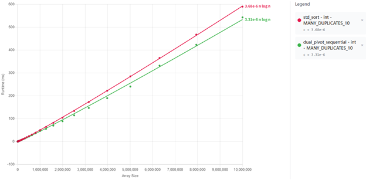{width=100%}
::::
:::: {.column width=34%}
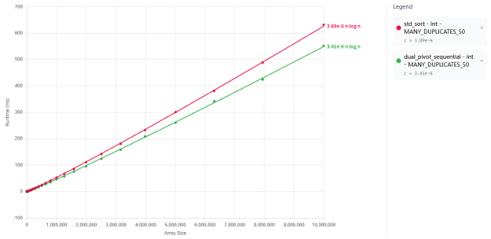{width=100%}
::::
:::: {.column width=34%}
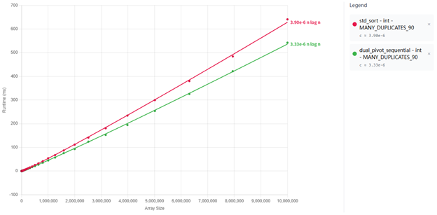{width=100%}
::::
:::

\footnotesize

**Absolute vs `std::sort`** (`int`, $n = 10^7$): **1.09--1.18$\times$** across the whole duplicate range --- widest margin at *light* duplication, not heavy.

**Why no huge win over our own random baseline?** The input is still randomly permuted, so (i)~run-merging bails out --- constant sub-sequences are length~1, (ii)~the 5-sample oracle only flags duplicates probabilistically, firing reliably once sub-arrays shrink enough that 5 random draws collide, (iii)~each DNF call absorbs only one pivot-value's band --- typically 10--20\% of the sub-problem.

**Why we still win against `std::sort`.** libstdc++ is 2-way introsort with no DNF. Heavy duplicates luckily centre its pivots, so it stays competitive there; at moderate duplication its pivot quality degrades and our DNF keeps a steady edge.

\normalsize

---

# Sequential Summary — One Table, Every Pattern

\begin{center}
\begin{tabular}{lcl}
\toprule
\textbf{Pattern} & \textbf{Speedup} & \textbf{Responsible guard} \\
\midrule
Already sorted & \textcolor{good}{near-instant} & Early termination (Step 1) \\
\texttt{int8\_t} / \texttt{int16\_t} random & \textcolor{good}{$\sim$8$\times$ / $\sim$6$\times$} & Counting-sort dispatch (Step 2) \\
Random \texttt{int} & $\sim$1.0$\times$ (parity) & Insertion-sort leaves (4.1 / 4.2) \\
Nearly-sorted & $\approx 0.74\times$ (slower) & \texttt{try\_merge\_runs} bails out (4.3) \\
Reverse-sorted & \textcolor{good}{\textbf{$\approx 10\times$, near-linear}} & \texttt{try\_merge\_runs} (4.3) \\
Many duplicates (any mix) & \textcolor{good}{1.09--1.18$\times$} & DNF partition (4.6b) \\
\bottomrule
\end{tabular}
\end{center}

\vfill
\begin{center}
\color{accent}\emph{Every number above comes from the same hardware, same 10$^7$ elements, same methodology.}
\end{center}

---

# Section 4 — Parallel Path

\large

\begin{enumerate}
\item {\color{gray}The Product}
\item {\color{gray}Research Gap \& Methodology}
\item {\color{gray}Sequential Walkthrough}
\item \textcolor{accent}{\textbf{Parallel Path}} \hfill \textcolor{accent}{\textbf{◀}}
\item {\color{gray}VTune Root-Cause}
\item {\color{gray}Engineering, Limitations, Conclusion}
\item {\color{gray}Q \& A}
\end{enumerate}

---

# Parallel Path — Work-Stealing Thread Pool

::: columns
:::: {.column width=52%}

\footnotesize

```text
Partition tree                Worker deques
       [root]                  W0: [_|_|_]
         |                     W1: [_|_]
    +----+----+                W2: []      <- idle
    |    |    |                W3: [_]
  big  mid  small
  (W0) (W1) (W2)
                  Worker W2 is idle:
                  -> steals tail from W0
```

**Rules**

- Push two larger sub-ranges to own deque; keep smallest (loop)
- Idle worker steals from another deque's tail (sticky-victim)
- `MIN_PARALLEL_SORT_SIZE` cutoff prevents micro-tasks

**Start-up (few tasks, many idle workers)**

At launch only the root partition exists — 1 task, N-1 idle workers. Idle workers consult a global "done" flag; while it stays unset they spin on a steal loop, picking a random victim deque and trying to pop its tail. As the tree fans out the deques fill and hits become common; steals only fail when the whole tree is nearly drained, at which point the root task's completion flips the flag and every spinner exits.

See refs [7], [8] for the theoretical basis.

::::
:::: {.column width=48%}

**Scaling — 10⁷ random int**

| T | Time (ms) | Speedup | Eff. |
|---|:---:|:---:|:---:|
| 1 | 513.4 | 1.00$\times$ | 100 % |
| 2 | 394.7 | 1.30$\times$ | 65 % |
| 4 | 159.8 | 3.21$\times$ | 80 % |
| \textbf{8} | \textbf{108.7} | \textbf{\color{good}4.72$\times$} | 59 % |
| 16 | 244.9 | 2.10$\times$ | \color{bad}13 % |

\vspace{0.4em}

Peak at 8T; 16T regresses (see VTune slide for root cause).

::::
:::

---

# Scaling Chart + the 8T Peak

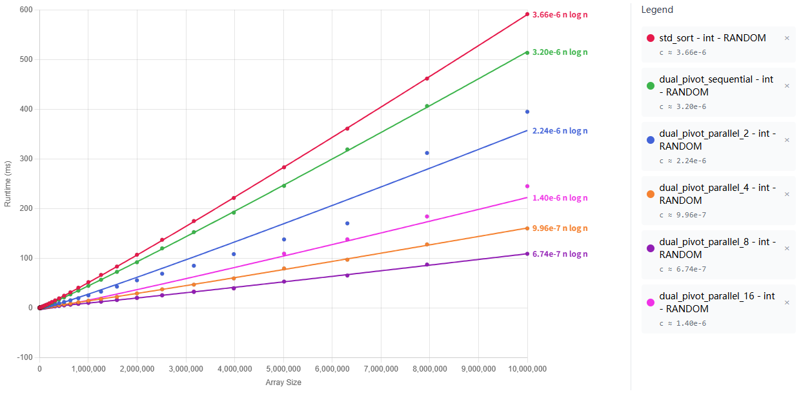{width=85%}

\begin{center}\small
Near-linear through 4T $\to$ sweet spot at \textbf{8T (4.72$\times$)} $\to$ \textcolor{bad}{\textbf{regression at 16T}}. \\
\textbf{Why?} Four stacked hardware ceilings — next slide.
\end{center}

---

# Section 5 — VTune Root-Cause

\large

\begin{enumerate}
\item {\color{gray}The Product}
\item {\color{gray}Research Gap \& Methodology}
\item {\color{gray}Sequential Walkthrough}
\item {\color{gray}Parallel Path}
\item \textcolor{accent}{\textbf{VTune Root-Cause}} \hfill \textcolor{accent}{\textbf{◀}}
\item {\color{gray}Engineering, Limitations, Conclusion}
\item {\color{gray}Q \& A}
\end{enumerate}

---

# VTune Root-Cause — Four Stacked Ceilings (8T vs 16T)

\footnotesize

\begin{tabular}{lrrrp{6.8cm}}
\toprule
\textbf{Metric} & \textbf{8T} & \textbf{16T} & \textbf{$\Delta$} & \textbf{Diagnosis} \\
\midrule
\textbf{L3-Bound} (\% ticks)      & 14.5\% & \textbf{25.1\%} & \textcolor{bad}{\textbf{+10.6 pp}} & \textbf{(1)} Working set overflows 20 MB L3 \\
\textbf{Machine Clears} (\% slots)& 1.8\%  & \textbf{7.5\%}  & \textcolor{bad}{\textbf{$\times$4.2}} & \textbf{(3)} SMT memory-order nukes \\
L2-Bound (\% ticks)               & 0.0\%  & 1.0\%           & +1.0 pp  & \textbf{(3)} SMT siblings share L2 \\
L1-Bound (\% ticks)               & 13.8\% & 14.7\%          & +0.9 pp  & \textbf{(3)} SMT siblings share L1D \\
Slow-Pause spin-wait              & 0.0\%  & 0.8\%           & +0.8 pp  & \textbf{(4)} Mutex/steal contention \\
E-core clockticks                 & 10.9G  & \textbf{29.8G}  & \textcolor{bad}{\textbf{$\times$2.7}} & \textbf{(2)} Work spilled to slower cores \\
E-core CPI                        & 1.37   & 1.37            & ---      & E-core $\approx$20\% slower / instr than P-core (1.14) \\
\textbf{P-core CPI}               & 1.14   & \textbf{1.55}   & \textcolor{bad}{\textbf{+36\%}} & Net: every instr pays more cycles \\
DRAM-Bound                        & 0.6\%  & 0.5\%           & $\approx$0 & \color{good}\textbf{Bandwidth is NOT the bottleneck} \\
\bottomrule
\end{tabular}

\normalsize\vspace{0.4em}
**Four stacked effects:** \textbf{(1)} L3 latency \; $\gg$ \; \textbf{(2)} hybrid-core dilution \; $>$ \; \textbf{(3)} SMT cache sharing \; $>$ \; \textbf{(4)} mutex contention.

\begin{center}\color{accent}\emph{The silicon is the ceiling — not our algorithm, not our thread pool.}\end{center}

---

# Section 6 — Engineering, Limitations, Conclusion

\large

\begin{enumerate}
\item {\color{gray}The Product}
\item {\color{gray}Research Gap \& Methodology}
\item {\color{gray}Sequential Walkthrough}
\item {\color{gray}Parallel Path}
\item {\color{gray}VTune Root-Cause}
\item \textcolor{accent}{\textbf{Engineering, Limitations, Conclusion}} \hfill \textcolor{accent}{\textbf{◀}}
\item {\color{gray}Q \& A}
\end{enumerate}

---

# Engineering — "Using C++ Well"

::: columns
:::: {.column width=52%}

- **Header-only, zero deps** — one `#include`, any C++17 build
- **Fully generic templates** — `T`, iterator category, `Compare` all type-parameters
- **STL-compatible iterator adapter**
  - contiguous → raw-pointer fast path (zero-cost)
  - non-contiguous → temporary buffer
- **`if constexpr` compile-time dispatch** — counting / float / dual-pivot decided at compile time
- **Hardware hints** — `DPQS_PREFETCH_READ` wraps `__builtin_prefetch` on the partition hot loop

::::
:::: {.column width=48%}

**Modular headers**

\small

```text
include/
 dual_pivot_quicksort.hpp   (façade)
 dpqs/
   sequential_sorters.hpp
   run_merger.hpp
   counting_sort.hpp
   thread_pool.hpp
   utils.hpp
```

\normalsize

::::
:::

---

# Limitations, Reflection & Conclusion

::: columns
:::: {.column width=50%}

**Honest Limitations**

- \textcolor{bad}{Not stable} — like `std::sort`, unlike `std::stable_sort`
- \textcolor{bad}{Move-only types} — run-merger needs a copy path
- \textcolor{bad}{Nearly-sorted regression} at some sizes — threshold tuning WIP

**Reflection**

\begin{tcolorbox}[colback=accent!5,colframe=accent,boxrule=0.5pt]
\footnotesize The biggest lesson wasn't the algorithm — it was that the real engineering is the \textbf{7\,800-configuration harness + multi-seed methodology} that makes every tuning decision defensible.
\end{tcolorbox}

::::
:::: {.column width=50%}

**Delivered**

- Header-only, STL-compatible DPQS for C++17
- Adaptive: counting sort · run-merger · DNF · introsort fallback
- Work-stealing parallel — **4.72$\times$** peak
- VTune-validated root-cause for the scaling curve

::::
:::

---

# Section 7 — Q & A

\large

\begin{enumerate}
\item {\color{gray}The Product}
\item {\color{gray}Research Gap \& Methodology}
\item {\color{gray}Sequential Walkthrough}
\item {\color{gray}Parallel Path}
\item {\color{gray}VTune Root-Cause}
\item {\color{gray}Engineering, Limitations, Conclusion}
\item \textcolor{accent}{\textbf{Q \& A}} \hfill \textcolor{accent}{\textbf{◀}}
\end{enumerate}

---

# Q & A

\vfill

\begin{center}
{\Huge \color{accent}\textbf{Questions?}}\\[1.2em]
{\large Thank you for your attention.}\\[2em]
\end{center}

\vfill

---

# References

\footnotesize

[1] C. A. R. Hoare, "Quicksort," *The Computer Journal*, vol. 5, no. 1, pp. 10–16, 1962.

[2] V. Yaroslavskiy, "Dual-pivot quicksort algorithm," Research report, 2009. [Online]. Available: http://codeblab.com/wp-content/uploads/2009/09/DualPivotQuicksort.pdf

[3] D. R. Musser, "Introspective sorting and selection algorithms," *Software: Practice and Experience*, vol. 27, no. 8, pp. 983–993, Aug. 1997.

[4] T. Peters, "Timsort," CPython `listsort` description, 2002. [Online]. Available: https://github.com/python/cpython/blob/main/Objects/listsort.txt

[5] E. W. Dijkstra, *A Discipline of Programming*. Englewood Cliffs, NJ, USA: Prentice-Hall, 1976.

[6] H. H. Seward, "Information sorting in the application of electronic digital computers to business operations," M.S. thesis, MIT, Cambridge, MA, USA, 1954.

[7] R. D. Blumofe and C. E. Leiserson, "Scheduling multithreaded computations by work stealing," *Journal of the ACM*, vol. 46, no. 5, pp. 720–748, Sep. 1999.

[8] D. Chase and Y. Lev, "Dynamic circular work-stealing deque," in *Proc. 17th ACM Symp. Parallelism in Algorithms and Architectures (SPAA)*, 2005, pp. 21–28.

[9] M. Aumüller and M. Dietzfelbinger, "Optimal partitioning for dual-pivot quicksort," *ACM Transactions on Algorithms*, vol. 12, no. 2, art. 18, Feb. 2016.

[10] Intel Corporation, *Intel VTune Profiler User Guide*, version 2025.10, 2025. [Online]. Available: https://www.intel.com/content/www/us/en/docs/vtune-profiler/user-guide/

---

# Backup — `sort5_network` (9 Optimal Comparators)

\footnotesize

```text
// e1 e2 e3 e4 e5  (indices into the array)
 1:  (e1,e2)   if a[e1]>a[e2] swap
 2:  (e4,e5)   if a[e4]>a[e5] swap
 3:  (e3,e5)   if a[e3]>a[e5] swap
 4:  (e3,e4)   if a[e3]>a[e4] swap
 5:  (e2,e5)   if a[e2]>a[e5] swap
 6:  (e1,e4)   if a[e1]>a[e4] swap
 7:  (e1,e3)   if a[e1]>a[e3] swap
 8:  (e2,e4)   if a[e2]>a[e4] swap
 9:  (e2,e3)   if a[e2]>a[e3] swap
```

\normalsize
**Properties**

- Proven optimal: 9 is the minimum comparator count to sort 5 elements
- Data-dependency depth = 6 → pipelines well on modern OoO CPUs
- Branch-free conditional swap via `std::min` / `std::max` (`cmov`)

---

# Backup — Multi-Seed Protocol (Why Median-of-Medians?)

\footnotesize

```text
for seed in {42, 43, ..., 51}:                # 10 seeds
    data = generate_random(size, seed)
    for w in 1..3:  sort(copy_of(data))       # warmup
    times = []
    for i in 1..10: times.push(time(sort(copy_of(data))))
    per_seed_median = median(times)           # absorbs run jitter
medians = [...]                               # 10 per-seed medians
representative = median(medians)              # absorbs one unlucky seed
```

\normalsize
\vspace{0.3em}

- **Mean across seeds** → skewed by one bad permutation
- **Min across seeds** → rewards one lucky permutation
- **Median-of-medians** → robust to both; aligns with current HPC benchmarking practice

---

# Backup — Full Hardware Spec (from CPU-Z)

\footnotesize

::: columns

:::: {.column width=50%}

**CPU — Intel Core i5-12600KF**

| Field | Value |
|-------|-------|
| Generation | 12th Gen, Alder Lake |
| Socket | LGA1700 |
| Process | 10 nm |
| Cores / threads | 10 (6P + 4E) / **16** |
| Max TDP | 125 W |
| Core voltage | 1.172 V |
| Core #0 speed | $\sim$4489 MHz |
| Multiplier | $\times$45.0 (range 48.0–49.0) |
| Bus speed | 99.76 MHz |

**Caches**

| Level | Size |
|-------|------|
| L1-D | 6 $\times$ 48 KB + 4 $\times$ 32 KB |
| L1-I | 6 $\times$ 32 KB + 4 $\times$ 64 KB |
| L2 | 6 $\times$ 1.25 MB + 2 $\times$ 2 MB |
| L3 | **20 MB** shared |

::::

:::: {.column width=50%}

**Memory — 32 GB DDR5**

| Field | Value |
|-------|-------|
| Type | DDR5 |
| Size | 32 GB |
| Channels | 4 $\times$ 32-bit (dual-channel) |
| DRAM frequency | 2992.7 MHz (eff. $\sim$5985 MT/s) |
| Memory ctrl freq | 1496.3 MHz |
| LLC / Ring | 3591.2 MHz |

**Primary Timings**

| Param | Clocks |
|-------|:---:|
| CAS Latency (CL) | 36 |
| tRCD | 38 |
| tRP | 38 |
| tRAS | 80 |
| tRC | 118 |
| Command Rate | 2T |

**Software**

- Windows 11 · GCC 13.3.0 (MinGW-w64)
- `-std=c++17 -O2 -march=native -DNDEBUG -pthread`
- VTune Profiler 2025.10.0 (`uarch-exploration`) [10]

::::

:::
